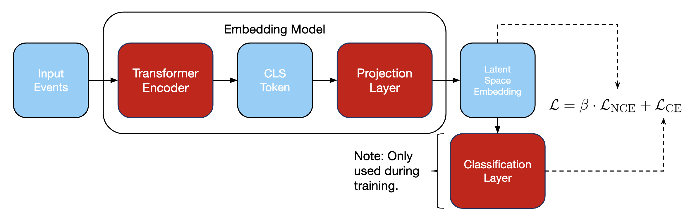

# TAC-HEP FPGA Programming Course Final Project: Foundation Model for CMS Data

## Introduction

This this project, we applied `hls4ml` to attempt the synthesis of a transformer encoder-based foundation model. This algorithm is currently under development for anomaly detection athe CMS Phase-2 Level-1 (L1) trigger system, although the model used here was a version intended for the HLT menu in Run 3, and which the Phase-2 version of the model will be based on. The primary objective was to use the high-level synthesis workflow to compare the outputs of a hardware targeted model against the original PyTorch implementation. The architecture used for this study processes kinematics from the 400 highest $p_T$ particles per event. It uses as features the $p_T$, $\eta$, $\phi$, $d_{xy}$, $d_{xy}$ significance, the PDGID, charge and a PF-candidate flag. These features are constructed and processed through a [`PFPreProcessor`](./src/embedding/preprocs.py) module. Notably, the model uses a modified attention mechanism designed to scale linearly with the number of input tokens [1]. The figure below shows a simplified version of the architecture being used as well as the loss function used.

## Attempting to Synthesize a Transformer Encoder

The first phase of the project focused on synthesizing a previously trained Run 3 model. This process immediately highlighted the fundamental differences between the development of a ML software algorithm and the synthesis of thi smodel. The original PyTorch model contained branching paths and dynamic logic, such as optional pairwise feature calculations, which are incompatible with the static nature of FPGA firmware. To address this, I refactored portions of the model code to remove divergences and hardcoded parameters like the embedding size and token count, which were previously determined at runtime. Despite these efforts to make the architecture more HLS friendly and compatible with the `hls4ml` parser, direct conversion from PyTorch and intermediate conversion via ONNX failed. The converted repeatedly encountered unsupported operations such as `Shape` and `Constant` despite there being no obvious use of these. Not even the use of graph-simplifying tools like `onnxsim` was sufficient to produce an ONNX model that the `hls4ml` could successfuly parse.

## Attempting the Conversion of a Simple NN

To isolate the issues experienced with the foundation model and gain a better understanding of how `hls4ml` worked, I transitioned to a simpler, diagnostic case study involving a simple neural network with a single hidden layer. Unfortunately, this too did not work, as attempts at converting the model were met with an error indicating that `Gemm` was an unsupported operation.

## Conclusions

This project served as a valuable starting point for the next phase of my TAC-HEP research project as I moved towards developing an anomaly detection ML model for the Phase-2 L1 trigger system. Ultimately, while the full model architecture used proved too complex for immediate synthesis within the scope of this course project, the experience provided essential insights into hardware-aware design. Transitioning a model designed for the HLT to the one adapted to the Phase-2 L1 trigger system will require a shift in development mindset, where every operation needs to be evaluated for its synthesis potential from the beggining of the design phase. 

---

[1] http://arxiv.org/abs/2006.04768

